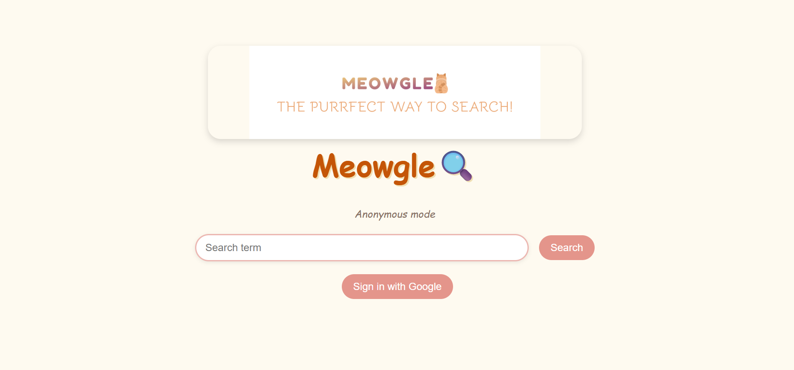

# Meowgle 🐱🔍


Meowgle is a toy search engine built for ECE326 at the University of Toronto.
It provides a Google-style interface on top of a custom web crawler, 
inverted index, and PageRank backend, deployed on AWS EC2.

## Features

### Frontend
- **Meowgle UI** — centered logo, custom cat cursor, pastel colour palette
- **Search box with autocomplete** — inline completion and dropdown suggestions
- **Multi-word searching** — query split into tokens, ranked by match count then PageRank
- **Result cards** — title, URL, snippet, and PageRank score per result
- **Pagination** — 10 results per page with numbered buttons and Previous/Next
- **Recent searches** — up to 10 most recent queries shown as clickable chips (logged-in users)
- **Account avatar** — email initial in top-right corner with sign out dropdown
- **Anonymous mode** — search without logging in, global suggestions still available

### Backend
- Built with **Bottle** and **Beaker** sessions
- SQLite database with `Lexicon`, `InvertedIndex`, `Documents`, and `PageRank` tables
- Multi-word query processing — fetches word IDs, finds matching documents, ranks by match count and PageRank
- Per-user search history stored in separate database
- **Google OAuth login** via `oauth2client` and `googleapiclient`

### Deployment
- Automated AWS EC2 deployment script using Boto3
- Creates security group, launches instance, SSHes in, installs dependencies, starts server
- Separate termination script to cleanly shut down the instance

## Project Structure

```text
frontend/
  app.py                 # Main Bottle application
  static/
    main.css
    img/
      Cat_.png           # Custom cursor
      design.png         # Favicon
      logo-png.png       # Logo banner
  views/
    base.tpl             # Base layout
    home.tpl             # Home page
    results.tpl          # Results page
    error.tpl            # Error page

backend/
  crawler.py
  pagerank.py
  storage.py
  test_crawler.py
  test_storage.py

requirements.txt
deployment.py
termination.py
README.md
```

## Setup

### 1. Prerequisites
- Python 3.8+
- pip

### 2. Install dependencies
```bash
pip install -r requirements.txt
```

### 3. Google OAuth
The app expects a `client_secret.json` file in the frontend directory.
Generate this from Google Cloud Console by creating an OAuth 2.0 Client ID.
Never commit this file to a public repository.

### 4. AWS Credentials
Create a `credentials.txt` file with your AWS access key, secret key, and region.
Never commit this file to a public repository.

### 5. Database
Run the crawler to generate `search.db` before starting the frontend:
```bash
cd backend
python crawler.py
```
`history.db` is auto-created on first run.

## Running Locally

```bash
cd frontend
python app.py
```
Then open `http://localhost:8080/` in your browser.

## Deployment on AWS

```bash
python deployment.py
```
Returns the public DNS and instance ID once the server is live.

## Termination

```bash
python termination.py
```
Enter the instance ID when prompted to terminate the EC2 instance.

## Technologies
- Python, Bottle, Beaker
- SQLite, BeautifulSoup
- Google OAuth 2.0
- AWS EC2, Boto3